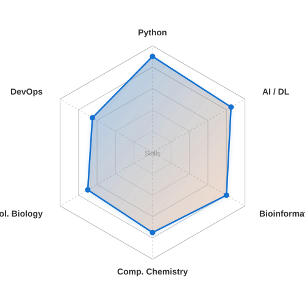

<h3 align="center">Hi, I'm Ziyan Zhuang <picture><source srcset="https://fonts.gstatic.com/s/e/notoemoji/latest/1f44b/512.webp" type="image/webp"></picture></h3>

  Life Science Researcher — <b>Synthetic Biology</b> · <b>Protein Language Models</b> · <b>AI for Science</b> 
  B.S. Biological Science @ <a href="https://www.xju.edu.cn/">XJU</a> (Top 1%) · Summer programs @ <a href="#">SJTU</a> &amp; <a href="#">PKU</a> 
  Creator of <a href="https://github.com/ZiyanZhuang/CYPForge">CYPForge</a> · <a href="https://github.com/ZiyanZhuang/AutoGraphRAG">AutoGraphRAG</a> · <a href="https://github.com/ZiyanZhuang/ProXplorer">ProXplorer</a>

  

  
  
  
  
  
  

  
  
  
  
  

